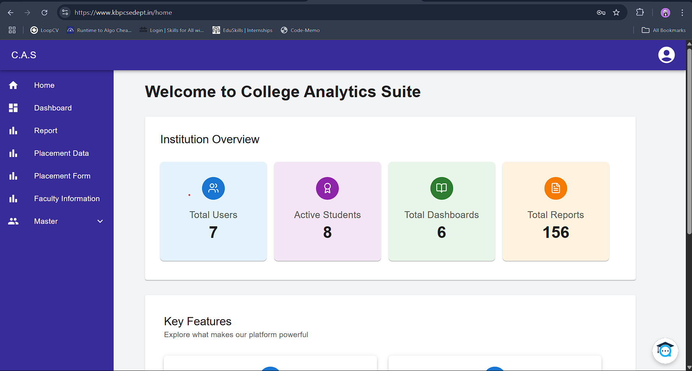
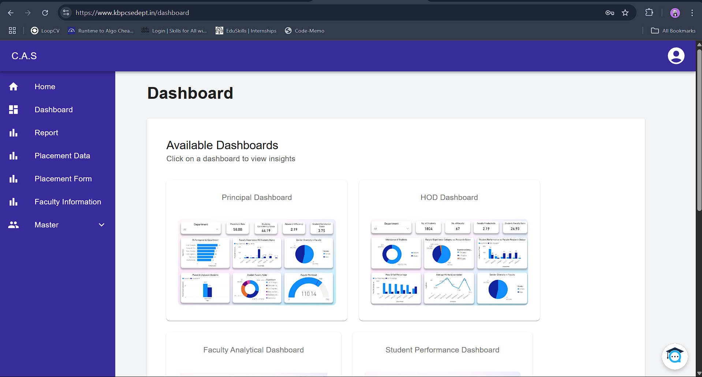
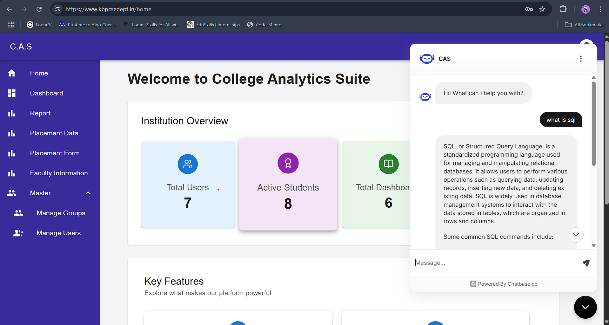
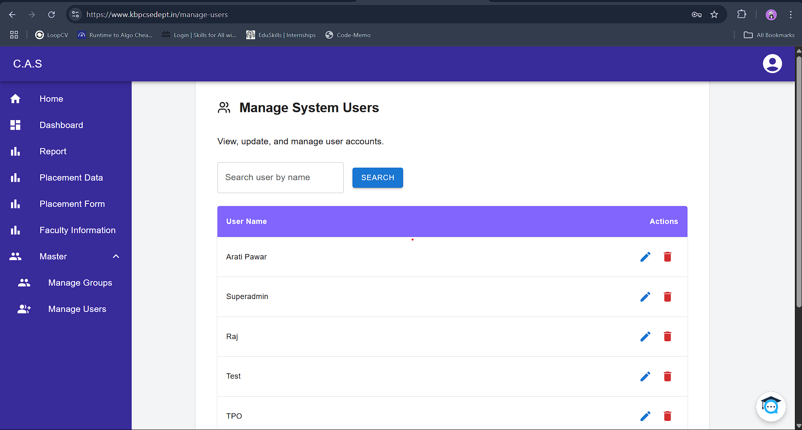
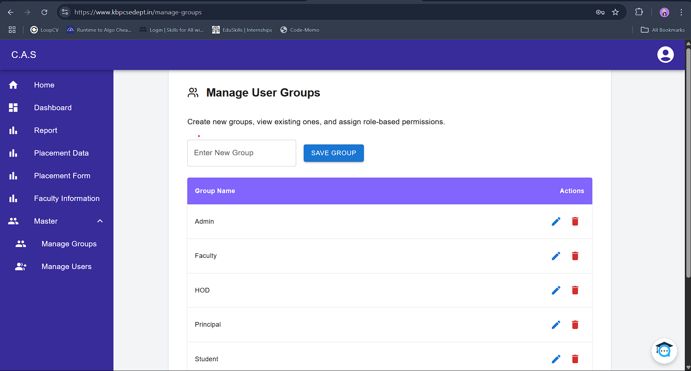
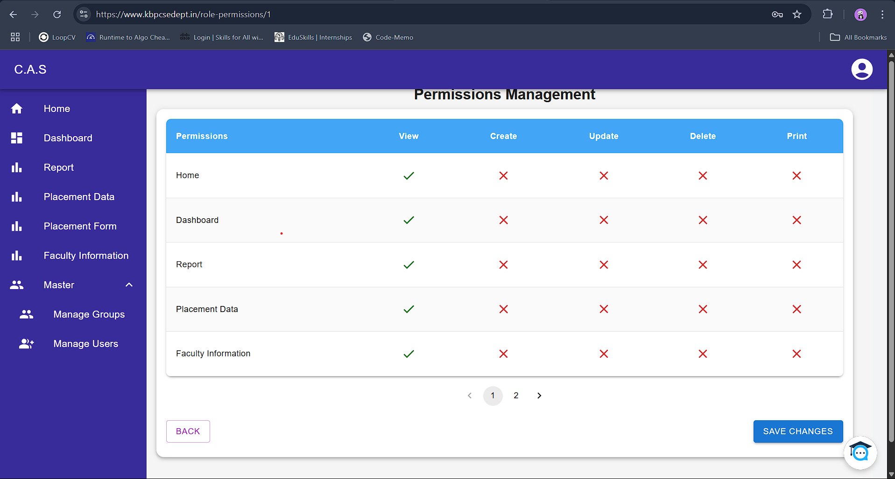

# 📚 EduVision

---

## 🧭 Table of Contents

- [About EduVision](#about-eduvision)
- [Visual Overview](#-visual-overview)
- [Key Features](#-key-features)
- [AI-Powered Predictive Analytics](#-ai-powered-predictive-analytics)
- [Folder Structure](#-folder-structure)
- [Notes](#-note)
- [Thank You](#-️-thank-you-for-exploring-eduvision)

---

## About EduVision

Moving away from a text-centric and word-heavy approach, **EduVision** focuses on **interactive visualization** of the client's core activities and projects.

This visualization allows users to gain **quick insights** based on individual interests.  
All activities are **clickable** and lead to **more detailed information**.  
Users can explore the content following different approaches based on their preferences.

---

## 🖼️ Visual Overview

### Home

### Dashboard

### Chatbot

### User Management

### Group Management

### Permission Management

---

## 🚀 Key Features

### 📄 Automated Report Generation
- Automatically compile structured reports.
- Saves hours of manual work.

### 📊 Interactive Dashboards

- Financial Dashboard
- Principal Dashboard
- HOD Dashboard
- Faculty Dashboard
- Student Performance Dashboard
- Student Profile Dashboard
- Placement Dashboard

Each dashboard provides **dynamic** and **data-driven insights** tailored for the education sector.

---

## 🤖 AI-Powered Predictive Analytics

1. **Predict Future Trends**  
   - Use machine learning models like regression analysis and time series forecasting.
   - Predict academic performance, research output, and budget utilization.

2. **Anomaly Detection**  
   - Automatically identify outliers and irregular patterns.
   - Alert management teams for early corrective action.

3. **Resource Planning**  
   - Suggest optimal allocation of resources based on historical data and AI projections.

4. **Early Warnings**  
   - Identify potential risks like high dropout rates or falling research output.
   - Empower institutions to act proactively.

---

# ❤️ Thank you for exploring EduVision!

> "Turning complex educational data into simple, beautiful insights."
